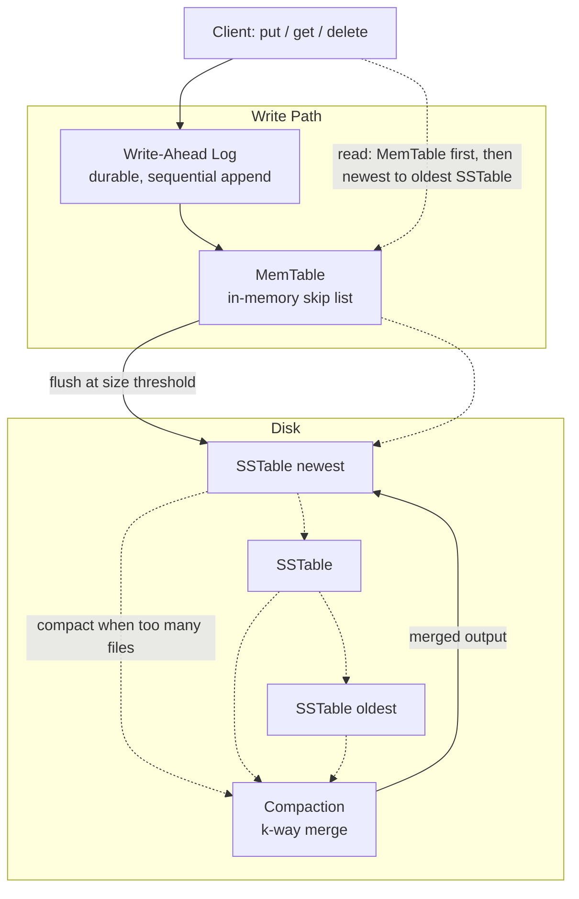

# lsm-db

A log-structured merge-tree (LSM-tree) key-value storage engine, built from scratch in Java to understand — end to end — how databases like RocksDB, LevelDB, and Cassandra actually work under the hood.

This is not a wrapper around an existing database. Every component below — the skip list, the write-ahead log, the SSTable file format, the bloom filter, the compaction merge, the MVCC snapshot system — is implemented from first principles.

## Architecture



## How a write flows through the system

1. **Write-Ahead Log** — every put/delete is appended to a log file and fsync'd to disk *before* touching anything else. If the process crashes at any point after this, the write is durable and will be replayed on restart.
2. **MemTable** — a hand-built skip list holding the most recent writes in sorted order, in memory. Deletes are recorded as tombstones, not physical removals — this matters once data spans multiple files.
3. **SSTable flush** — once the MemTable crosses a size threshold, it's written to disk as an immutable, sorted file (data block + bloom filter + sparse index + footer), and a fresh MemTable takes over. The WAL is truncated at this point, since its contents are now durably captured in the SSTable.
4. **Compaction** — once too many SSTable files accumulate, they're merged via a k-way merge (min-heap based) into a single file, discarding overwritten values and expired tombstones.
5. **Reads** check the MemTable first, then SSTables newest-to-oldest, each guarded by a bloom filter so files that definitely don't contain the key are skipped without any disk I/O.

## Features implemented

| Component | What it does |
|---|---|
| **SkipList** | Hand-built probabilistic sorted structure backing the MemTable — O(log n) insert/search via randomized leveling, no tree rotations |
| **Write-Ahead Log** | Crash-safe durability: length-prefixed binary records with CRC32 checksums, detects and gracefully discards torn writes from a crash mid-append |
| **SSTable** | Immutable on-disk sorted file format with a sparse index (binary search + seek + short scan) for fast point lookups without loading the whole file |
| **Bloom Filter** | Auto-sized bit array + FNV-1a hashing (Kirsch-Mitzenmacher trick) — lets reads skip files that definitely don't contain a key, with zero false negatives |
| **Compaction** | Real k-way merge (min-heap) across multiple SSTables, resolving duplicate keys by recency and reclaiming space from deleted/overwritten data |
| **KVEngine** | Ties everything together: WAL-first durability, auto-flush on size threshold, auto-compaction, multi-source reads with correct tombstone shadowing |
| **MVCC + Transactions** | Sequence-numbered versions with snapshot-isolated reads, plus begin/put/commit/rollback transactions with atomic multi-key visibility |

## Design decisions and tradeoffs

- **LSM-tree over B-tree**: optimizes for write throughput (sequential appends) at the cost of read amplification, mitigated here with bloom filters and sparse indexing. This is the same tradeoff RocksDB/Cassandra make for write-heavy workloads.
- **fsync on every write**: chosen for correctness-first learning over throughput. Real systems often batch writes before syncing ("group commit") — a natural next optimization.
- **Size-tiered, "compact everything" strategy**: simpler than leveled compaction (what RocksDB uses), at the cost of higher write amplification on large datasets. A leveled strategy would be the natural next iteration.
- **Standalone MVCC module**: the MVCC/transaction layer is not yet wired into the persistent MemTable/WAL/SSTable stack — it's a self-contained, fully tested demonstration of the versioning mechanism, deliberately scoped this way to keep the change reviewable rather than rewriting the entire persistence layer at once.

## Running the demo

```bash
mvn compile exec:java 
```

This walks through basic CRUD, triggers an automatic flush and compaction, then simulates a crash by closing and reopening the engine — proving recovery actually works, not just describing it.

## Running the tests

```bash
mvn clean test
```

64+ tests across every component, including deliberately adversarial cases: simulated torn writes mid-crash, corrupted checksums, resource-leak-safe file handling, k-way merge correctness across interleaved keys, and snapshot isolation proven under concurrent-style access patterns.

## Project structure

```
src/main/java/com/lsmdb/
├── Main.java                  entry point / demo
├── storage/                   SkipList, SkipListNode, MemTable
├── wal/                       WriteAheadLog, WalEntry
├── sstable/                   SSTableWriter, SSTableReader
├── bloom/                     BloomFilter
├── compaction/                CompactionManager (k-way merge)
├── engine/                    KVEngine (ties it all together)
└── mvcc/                      MVCCStore, Transaction, VersionedKey
```